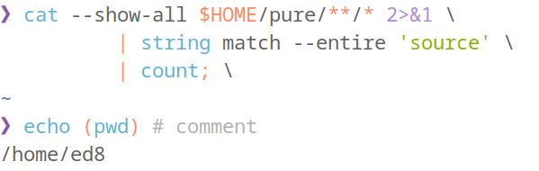
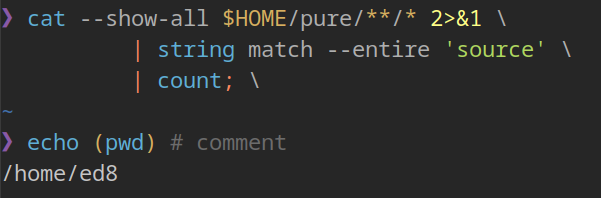
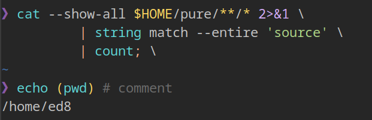

# ayu-theme.fish

> [ayu](https://github.com/dempfi/ayu) color scheme for Fish shell

## Installation

    fisher install edouard-lopez/ayu-theme.fish

## Configuration

Edit `~/.config/fish/config.fish` to load a variant, _e.g._:

    source $__fish_config_dir/conf.d/ayu-theme.fish/ayu-light.fish

## Variants

### Light

### Dark

### Mirage

## Credits

Based on [ayu-colors](https://github.com/ayu-theme/ayu-colors) values.
